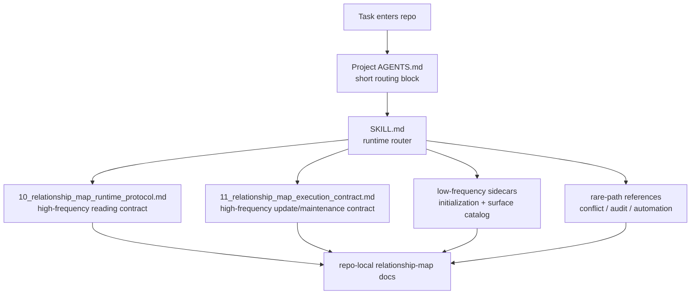

# Relationship Map Maintenance

Chinese version: [README.zh-CN.md](./README.zh-CN.md).

`relationship-map-maintenance` is a project-scoped skill for maintaining a compact relationship and change-impact layer around complex code changes.

It is designed for repositories where fixes and features regularly cross file, module, config, script, runtime, and test boundaries, and where "updated one place, missed another" is a recurring failure mode.

## Architecture



## What It Adds

- a project-scoped `docs/<project-scope>/relationship-map/` document set
- a minimal `AGENTS.md` routing block for persistent, low-cost read guidance
- curated `critical-chains/` and `impact-shards/` for high-value change surfaces
- a generated-evidence manifest so agents do not need to scan large folders by default
- conservative maintenance rules for conflict handling, lifecycle changes, audit logging, and automation

## Core Design Ideas

### 1. Keep the main skill focused on runtime routing

The main `SKILL.md` now owns only the high-frequency decisions:

- whether to trigger the skill
- whether the round is `use`, `update`, or `maintain`
- whether the read mode is `skip`, `light`, or `full`
- which support protocol or sidecar must be read next

Initialization, full surface catalog, conflict/deletion detail, and automation detail are moved off the main path.

### 2. Treat AGENTS as an index surface

The bundled `AGENTS.relationship-map-snippet.template.md` is designed to stay short and durable.

Use it to:

- carry compact routing rules
- point the agent to repo-local relationship-map docs
- state what should not be read by default during ordinary changes

Do not use it as a weak summary copy of the whole workflow. If a longer document is pointed to, the routing block should make the reading and non-reading cases clear.

### 3. Separate reading protocol from update/maintenance protocol

The skill now has two high-frequency support surfaces:

- `10_relationship_map_runtime_protocol.md`
- `11_relationship_map_execution_contract.md`

This keeps route-first reading, read budgets, and curated-vs-generated expansion separate from update, audit, lifecycle, and structural-maintenance rules.

### 4. Encode reading and non-reading cases explicitly

This skill aims to save context, not just add more documentation.

That means each longer document should answer:

- when it should be read
- when it should be skipped

Without explicit `read when` / `skip when` logic, routing still wastes context.

### 5. Preserve stable entrypoints and split below them

The relationship-map layer should treat these as stable read-first entrypoints:

- `00_index.md`
- `10_relationship_map_runtime_protocol.md`
- `11_relationship_map_execution_contract.md`

If one becomes too large, keep the entrypoint name stable and split below it with second-level routing.

## Default Operating Model

The default path is:

- `use`: route before a non-trivial change
- `update`: refresh only the touched relationship entries after a meaningful change
- `maintain`: run periodic upkeep only when needed

The default read modes are:

- `skip`: no relationship-map reads for clearly local, relationship-neutral changes
- `light`: read `00_index.md` and the minimum relevant shard summary only
- `full`: expand only when the change is high-risk, multi-surface, structurally important, or unresolved by `light`

## Repository Layout

```text
relationship-map-maintenance/
  SKILL.md
  10_relationship_map_runtime_protocol.md
  11_relationship_map_execution_contract.md
  initialization-and-adoption.md
  relationship-map-surface-catalog.md
  README.md
  README.zh-CN.md
  LICENSE
  agents/
    openai.yaml
  assets/
    AGENTS.relationship-map-snippet.template.md
    00_index.template.md
    01_usage_and_policy.template.md
    02_audit_log.template.md
    critical-chain.template.md
    impact-shard.template.md
    generated-manifest.template.md
    maintenance-report.template.md
    automation-prompt.template.md
  references/
    audit-and-automation.md
    automation-workflow.md
    conflict-lifecycle-and-deletion.md
```

## Installation

Copy the skill directory into your Codex skills location.

If the skill is used as a project-local skill, keep it under the repository's local skills directory.
If it is used as a user-level skill, install it under the user's Codex skills directory.

## Initialization

Initialization has two parts:

1. create the project-scoped relationship-map document layer under `docs/<project-scope>/relationship-map/`
2. add the minimal relationship-map routing block to the project-local `AGENTS.md`

The `AGENTS.md` integration is incremental:

- if `AGENTS.md` already exists, append the relationship-map block
- do not rewrite or reorganize unrelated `AGENTS.md` content
- create `AGENTS.md` only if the project does not already have one

Use `assets/AGENTS.relationship-map-snippet.template.md` for that block.

## Maintenance And Automation

The skill keeps maintenance conservative:

- generated evidence may be refreshed
- stale or conflicting shards may be flagged
- reports may be written when there are material findings or when a scheduled run requires one
- structural shard decisions should not be applied silently
- physical deletion requires explicit user approval
