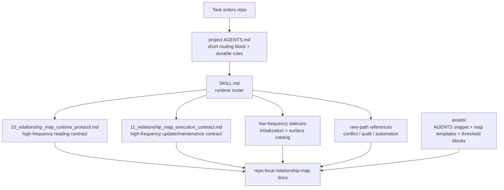

# Relationship Map Maintenance Skill

[中文说明](./README.zh-CN.md)

This repository packages a reusable Codex skill for building and maintaining a project-scoped relationship-map layer around complex code changes. The current version is structured as a runtime router, two high-frequency support protocols, low-frequency sidecars, and template assets that keep AGENTS routing, shard updates, and maintenance triggers explicit.

## Architecture



## Repository Layout

```text
relationship-map-maintenance-skill/
  README.md
  README.zh-CN.md
  .gitignore
  LICENSE
  docs/
    USAGE.md
  SKILL.md
  10_relationship_map_runtime_protocol.md
  11_relationship_map_execution_contract.md
  initialization-and-adoption.md
  relationship-map-surface-catalog.md
  agents/
    openai.yaml
  assets/
    AGENTS.relationship-map-snippet.template.md
    00_index.template.md
    01_usage_and_policy.template.md
    02_audit_log.template.md
    critical-chain.template.md
    impact-shard.template.md
    generated-manifest.template.md
    maintenance-report.template.md
    automation-prompt.template.md
  references/
    audit-and-automation.md
    automation-workflow.md
    conflict-lifecycle-and-deletion.md
```

## What Ships In The Skill

- `SKILL.md`: runtime router for trigger, mode, and depth decisions
- `10_relationship_map_runtime_protocol.md`: route-first reading contract for `skip` / `light` / `full`
- `11_relationship_map_execution_contract.md`: update, audit, lifecycle, and review-threshold contract
- low-frequency sidecars:
  - initialization and adoption
  - relationship-map surface catalog
- `references/`: conflict, audit, and automation detail kept off the hot path
- `assets/`: AGENTS snippet, relationship-map templates, and maintenance-threshold trigger blocks

## Core Design Ideas

### 1. Keep the main skill focused on runtime routing

The main `SKILL.md` is intentionally a hot-path router. Its job is to:

- decide whether the skill should trigger
- classify the round as `use`, `update`, or `maintain`
- choose the lightest safe mode: `skip`, `light`, or `full`
- route only into the next support file that is actually needed

Initialization, structural lifecycle detail, and automation detail stay off the main path so ordinary use does not pay for cold material.

### 2. Treat AGENTS as an index-bearing control surface

The bundled `AGENTS.relationship-map-snippet.template.md` is meant to stay short and durable. Use it to:

- carry compact routing rules
- point to repo-local relationship-map docs
- make the reading and non-reading cases explicit

It should not become a weak summary copy of the full workflow. If `AGENTS.md` points to a longer document, it should also tell the next agent when that document should be read and when it should be skipped.

### 3. Split reading protocol from execution and maintenance protocol

The skill has two high-frequency support surfaces:

- `10_relationship_map_runtime_protocol.md`
- `11_relationship_map_execution_contract.md`

This separates route-first reading, read-budget control, and curated-vs-generated expansion from update triggers, audit behavior, lifecycle rules, and review thresholds.

### 4. Encode `read when` / `skip when` decisions directly

The skill is built to reduce context spend, not merely add documentation. Each longer support surface answers both:

- when it should be read
- when it should be skipped

Without explicit `read when` / `skip when` routing, agents still waste context even if the files are well written.

### 5. Use thresholds and trigger-style reminders instead of silent drift

The design uses explicit gates and maintenance triggers rather than letting relationship-map layers grow unchecked.

- the main skill has hard `skip` and hard `full` gates so the skill does not over-trigger
- the execution contract defines review thresholds for larger or cross-surface changes
- the bundled templates start with `Maintenance Threshold` blocks so indexes, shards, manifests, and reports tell the user when second-level routing, archival, or cleanup is needed

This keeps the layer maintainable without making the hot path verbose.

### 6. Preserve stable entrypoints and reuse written results first

The stable read-first entrypoints are:

- `00_index.md`
- `10_relationship_map_runtime_protocol.md`
- `11_relationship_map_execution_contract.md`

If one grows too large, split below it instead of renaming the entrypoint. During runtime, prefer index before tree scan, shard summary before shard body, curated shard before generated evidence, and generated manifest before scanning a whole generated folder.

## Default Operating Model

The default path is:

- `use`: route before a non-trivial change
- `update`: refresh only the touched relationship entries after a meaningful change
- `maintain`: run periodic upkeep only when needed

The default read modes are:

- `skip`: no relationship-map reads for clearly local, relationship-neutral changes
- `light`: read `00_index.md` and the minimum relevant shard summary only
- `full`: expand only when the change is high-risk, multi-surface, structurally important, or unresolved by `light`

## When To Use This Skill

Use it when:

- a bug fix or feature likely crosses multiple files, modules, configs, scripts, runtime links, or tests
- the codebase has repeated omission-style failures across related surfaces
- the user wants pre-change impact analysis before a non-trivial edit
- the user wants explicit post-change relationship-map updates
- the user wants periodic maintenance or audit of relationship-map artifacts

Do not use it when:

- the change is clearly mechanical, local, and relationship-neutral
- a single-file edit has no meaningful upstream or downstream impact
- no reusable relationship artifact would result

## Installation Notes

### Install as a global Codex skill

Copy the packaged files into:

```text
<CODEX_HOME>/skills/relationship-map-maintenance/
```

### Install as a project-local skill

Copy the same files into:

```text
<repo>/.agents/skills/relationship-map-maintenance/
```

### Initialization behavior

Initialization has two parts:

1. create the project-scoped relationship-map layer under `docs/<project-scope>/relationship-map/`
2. append the minimal routing block to the project-local `AGENTS.md`

The `AGENTS.md` integration is incremental:

- if `AGENTS.md` already exists, append the relationship-map block
- do not rewrite or reorganize unrelated `AGENTS.md` content
- create `AGENTS.md` only if the project does not already have one

Use `assets/AGENTS.relationship-map-snippet.template.md` for that block.

## Usage

See [docs/USAGE.md](./docs/USAGE.md) for runtime order, mode selection, AGENTS-as-index guidance, and example prompts.

## Notes

- Repo-local code, configs, scripts, tests, and governance docs remain the higher authority.
- Relationship maps are a maintained routing and impact layer, not the source of implementation truth.
- If code or governance conflicts with a relationship map, refresh the map in the same workstream rather than forcing reality to match stale documentation.
- Default to `docs/<project-scope>/relationship-map/`.
- Use `docs/relationship-map/` only when the user explicitly wants one repository-wide relationship-map layer shared across multiple projects or experiments.
