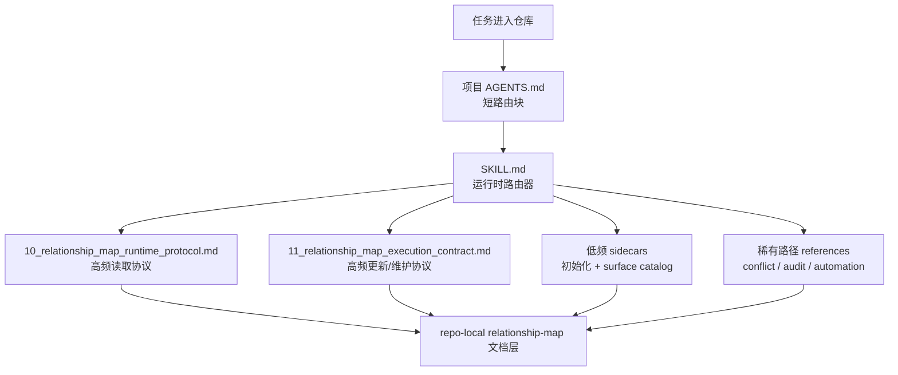

# Relationship Map Maintenance

English version: [README.md](./README.md)

`relationship-map-maintenance` 是一个面向项目的 skill，用来给复杂代码改动维护一层轻量、可路由的关系图与影响面文档。

它适合这类仓库：一个修复或功能往往会跨越代码、配置、脚本、运行时链路和测试，而且项目里经常出现“只改了一处，遗漏了另一处”的问题。

## 架构图



## 作用

- 为 `docs/<project-scope>/relationship-map/` 提供一套项目级文档结构
- 为项目根 `AGENTS.md` 提供一段最小的常驻路由块
- 用 `critical-chains/` 和 `impact-shards/` 表达高价值改动链路
- 用生成型证据清单避免默认扫描大目录
- 用保守的维护规则处理冲突、生命周期、审计和自动化

## 核心设计思想

### 1. 主 skill 只保留高频运行时路由

主 `SKILL.md` 现在只负责高频决策：

- 要不要触发这个 skill
- 当前轮次属于 `use`、`update` 还是 `maintain`
- 当前读取模式属于 `skip`、`light` 还是 `full`
- 下一步该读哪个 support protocol 或 sidecar

初始化、全量 surface 目录、冲突/删除细则、自动化细节都不再挤在主路径里。

### 2. 把 AGENTS 当作索引面

内置的 `AGENTS.relationship-map-snippet.template.md` 应该保持短而耐用。

它的职责是：

- 承载紧凑的路由规则
- 指向 repo-local 的 relationship-map 文档
- 说明普通改动默认不该读什么

它不应该变成整个 workflow 的弱化版摘要。只要它指向长文档，就应该同时让读者知道什么时候该读、什么时候不该读。

### 3. 读取协议和更新协议分层

这个 skill 现在有两个高频 support surface：

- `10_relationship_map_runtime_protocol.md`
- `11_relationship_map_execution_contract.md`

这样 route-first 读取、read budget、curated-vs-generated 扩展逻辑，就不会和 update、audit、lifecycle、structural maintenance 混在一起。

### 4. reading / not reading case 要显式写出来

这套 skill 追求的是省上下文，而不是只增加文档数量。

所以每个较长文档都应该明确：

- 什么时候该读
- 什么时候应跳过

如果没有显式的 `read when` / `skip when`，那路由本身仍然会浪费上下文。

### 5. 稳定入口保留，拆分发生在下层

relationship-map 层建议把这些作为稳定 read-first entrypoints：

- `00_index.md`
- `10_relationship_map_runtime_protocol.md`
- `11_relationship_map_execution_contract.md`

如果其中某个入口过长，就保留入口名稳定，把拆分做在其下层，而不是频繁改名。

## 默认工作方式

默认主路径分为三段：

- `use`：改动前先做路由和影响面判断
- `update`：改动后只更新真正被触及的关系项
- `maintain`：仅在需要时做周期性维护

默认读取模式分三档：

- `skip`：明显局部、关系中立的改动，不读 relationship-map
- `light`：只读 `00_index.md` 和最小相关 shard 的摘要
- `full`：仅在高风险、多表面、结构性改动或 `light` 不足时展开

## 目录结构

```text
relationship-map-maintenance/
  SKILL.md
  10_relationship_map_runtime_protocol.md
  11_relationship_map_execution_contract.md
  initialization-and-adoption.md
  relationship-map-surface-catalog.md
  README.md
  README.zh-CN.md
  LICENSE
  agents/
    openai.yaml
  assets/
    AGENTS.relationship-map-snippet.template.md
    00_index.template.md
    01_usage_and_policy.template.md
    02_audit_log.template.md
    critical-chain.template.md
    impact-shard.template.md
    generated-manifest.template.md
    maintenance-report.template.md
    automation-prompt.template.md
  references/
    audit-and-automation.md
    automation-workflow.md
    conflict-lifecycle-and-deletion.md
```

## 安装

把整个 skill 目录复制到 Codex 的 skills 目录下即可。

如果按项目安装，就放到仓库本地的 skills 目录。
如果按用户级安装，就放到用户自己的 Codex skills 目录。

## 初始化

初始化分两层：

1. 在 `docs/<project-scope>/relationship-map/` 下创建关系图文档层
2. 把最小的 relationship-map 路由块接入项目本地 `AGENTS.md`

`AGENTS.md` 的接入方式必须是增量式：

- 如果项目已经有 `AGENTS.md`，只追加 relationship-map 片段
- 不改写、不重组无关的 `AGENTS.md` 内容
- 只有项目没有 `AGENTS.md` 时才创建

对应片段模板在 `assets/AGENTS.relationship-map-snippet.template.md`。

## 维护与自动化

这个 skill 的维护策略保持保守：

- 可以刷新生成型证据
- 可以标记过期或冲突的 shard
- 只有在出现实质发现，或者定时任务明确要求时，才建议写维护报告
- 不应静默执行结构性 shard 变更
- 物理删除必须得到用户明确批准
