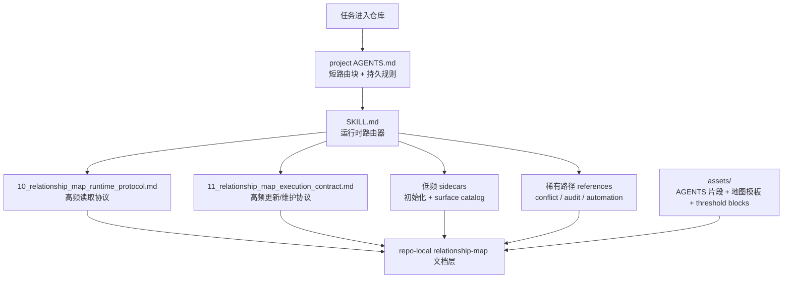

# Relationship Map Maintenance Skill

[English](./README.md)

这个仓库打包了一个可复用的 Codex skill，用于在复杂代码改动周围建立和维护项目级 relationship-map 文档层。当前版本采用“运行时路由器 + 两个高频协议文件 + 低频 sidecar + 模板资产”的结构，把 AGENTS 路由、shard 更新和维护触发器都写成显式机制，而不是隐含约定。

## 架构图



## 仓库结构

```text
relationship-map-maintenance-skill/
  README.md
  README.zh-CN.md
  LICENSE
  SKILL.md
  10_relationship_map_runtime_protocol.md
  11_relationship_map_execution_contract.md
  initialization-and-adoption.md
  relationship-map-surface-catalog.md
  agents/
    openai.yaml
  assets/
    AGENTS.relationship-map-snippet.template.md
    00_index.template.md
    01_usage_and_policy.template.md
    02_audit_log.template.md
    critical-chain.template.md
    impact-shard.template.md
    generated-manifest.template.md
    maintenance-report.template.md
    automation-prompt.template.md
  references/
    audit-and-automation.md
    automation-workflow.md
    conflict-lifecycle-and-deletion.md
```

## Skill 内包含什么

- `SKILL.md`：负责触发、模式和读取深度判断的运行时路由器
- `10_relationship_map_runtime_protocol.md`：`skip` / `light` / `full` 的 route-first 读取协议
- `11_relationship_map_execution_contract.md`：update、audit、lifecycle 和 review threshold 协议
- 低频 sidecars：
  - 初始化与接管
  - relationship-map surface catalog
- `references/`：把 conflict、audit、automation 细节留在热路径之外
- `assets/`：AGENTS 片段、relationship-map 模板，以及维护阈值触发块

## 核心设计思想

### 1. 主 skill 只保留运行时路由

主 `SKILL.md` 有意保持在热路径上。它的职责是：

- 判断这个 skill 是否应该触发
- 把当前轮次分类为 `use`、`update` 或 `maintain`
- 选择最轻且安全的模式：`skip`、`light`、`full`
- 只路由到当前真正需要读取的下一个 support file

初始化、结构性生命周期细节和自动化细节都放到主路径之外，避免普通使用为低频材料付上下文成本。

### 2. 把 AGENTS 当作带索引的控制面

内置的 `AGENTS.relationship-map-snippet.template.md` 目标是保持短而耐用。它应该用来：

- 承载紧凑的路由规则
- 指向 repo-local relationship-map 文档
- 把需要读取和不需要读取的情况都说明白

它不应该变成整套工作流的弱化版摘要。只要 `AGENTS.md` 指向长文档，就应该同时说明什么时候该读、什么时候该跳过。

### 3. 读取协议和执行/维护协议分层

这个 skill 有两个高频 support surface：

- `10_relationship_map_runtime_protocol.md`
- `11_relationship_map_execution_contract.md`

这样 route-first 读取、read budget 控制、curated-vs-generated 扩展逻辑，就不会和 update trigger、audit 行为、lifecycle 规则、review threshold 混在一起。

### 4. `read when` / `skip when` 必须显式写出来

这套 skill 的目标是减少上下文开销，而不只是增加文档数量。每个较长的 support surface 都应该同时回答：

- 什么时候该读
- 什么时候该跳过

如果没有显式的 `read when` / `skip when` 路由，即使文件本身写得不错，agent 仍然会浪费上下文。

### 5. 用阈值和触发器提醒取代静默漂移

这套设计依赖显式 gate 和 maintenance trigger，而不是让 relationship-map 层无声膨胀。

- 主 skill 里有 hard `skip` 和 hard `full` gate，避免 skill 过度触发
- execution contract 定义了更大或跨表面改动的 review threshold
- 模板文件开头带有 `Maintenance Threshold` 块，让 index、shard、manifest、report 在需要二级路由、归档或清理时能明确提醒用户

这样既能控制维护成本，也不会把热路径写得越来越长。

### 6. 稳定入口保留，优先复用已写结果

稳定的 read-first entrypoints 是：

- `00_index.md`
- `10_relationship_map_runtime_protocol.md`
- `11_relationship_map_execution_contract.md`

如果其中某个变得过长，应该在其下层拆分，而不是频繁改入口名。运行时则优先采用：先看 index，再看树；先看 shard summary，再看 shard body；先看 curated shard，再看 generated evidence；先看 generated manifest，再决定是否扫描整个 generated 目录。

## 默认工作方式

默认主路径是：

- `use`：在非平凡改动前先做路由
- `update`：在有实质变化后只刷新真正被触及的关系项
- `maintain`：只在需要时做周期性维护

默认读取模式是：

- `skip`：明显局部且关系中立的改动，不读取 relationship-map
- `light`：只读 `00_index.md` 和最小相关 shard 的摘要
- `full`：仅在高风险、多表面、结构性改动或 `light` 不足时展开

## 安装

### 作为全局 Codex skill 安装

把打包后的文件复制到：

```text
<CODEX_HOME>/skills/relationship-map-maintenance/
```

### 作为项目级本地 skill 安装

把同一套文件复制到：

```text
<repo>/.agents/skills/relationship-map-maintenance/
```

## 说明

- 对具体仓库而言，repo-local 的代码、配置、脚本、测试和治理文档仍然是更高 authority。
- Relationship map 是维护型的路由与影响层，不是实现真相源。
- 如果代码或治理文档与 relationship map 冲突，应在同一工作流里刷新 map，而不是让真实实现去迁就过期文档。
